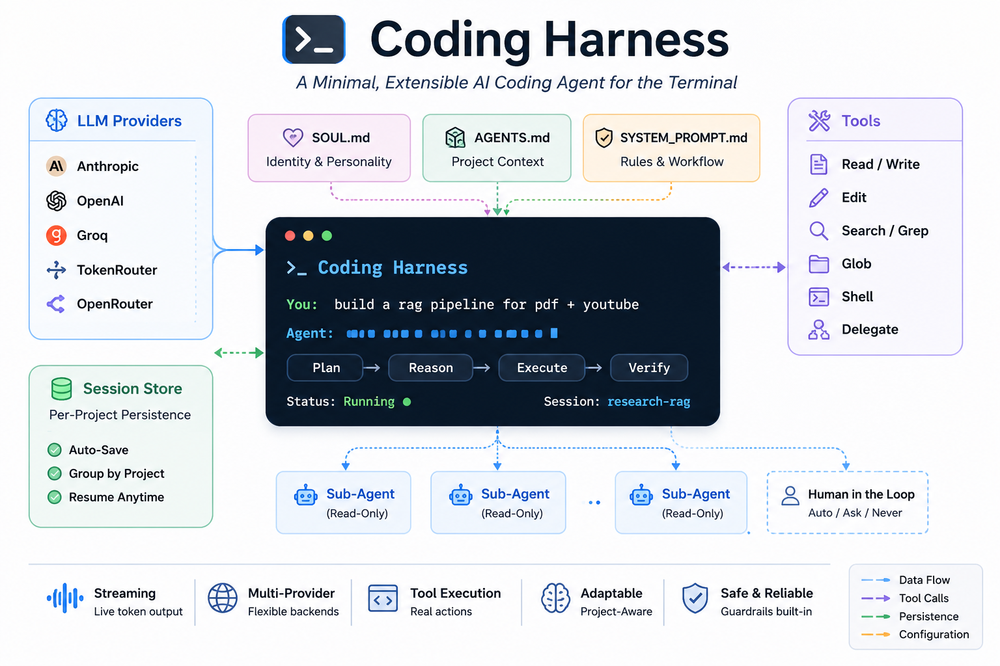

<h1 align="center">Coding Harness</h1>

<p align="center">
  <em>An AI coding agent that runs in your terminal — streams responses, executes tools, persists sessions, and adapts to your project.</em>
</p>

<p align="center">
  
  
  
  
</p>

---

## Features

- **Multi-provider** — Anthropic, OpenAI, Groq, TokenRouter, OpenRouter
- **Streaming** — Live token output as the model responds
- **Tool execution** — Read, write, edit, search, grep, glob, shell, delegate
- **Per-project sessions** — Auto-saved, grouped by project, resume anytime
- **Customizable personality** — Drop a `SOUL.md` in your project to define identity, communication style, and behavior
- **Customizable project context** — `AGENTS.md` to describe your tech stack, conventions, and commands
- **Customizable system prompt** — `SYSTEM_PROMPT.md` to control workflow, guardrails, and tool rules
- **Sub-agent delegation** — Independent read-only sub-agents for parallel exploration
- **Guardrails** — Built-in safety checks for tools and output
- **Human in the loop** — Auto, ask, or never approval policy

---

## Installation

### Prerequisites

- Python 3.10 or later
- An API key from any supported provider

### Install

```bash
git clone https://github.com/danishnaseer00/coding-harness.git
cd coding-harness
pip install -e .
```

This installs the `harness` command globally in editable mode — any changes you make to source files take effect immediately.

### Verify

```bash
harness --help
```

---

## Quick Start

```bash
cd /path/to/your/project
harness --cwd .
```

On first run, paste your API key at the prompt — it auto-detects the provider from the key prefix.

---

## Usage

### Command-line options

| Flag | Description |
|---|---|
| `--cwd <path>` | Working directory (default: `.`) |
| `--resume <id>` | Resume a specific session |
| `--provider <name>` | Override the default provider |
| `--model <name>` | Override the default model |
| `--policy {ask,auto,never}` | Approval policy for risky tools |

### Provider configuration

Set `CODING_HARNESS_PROVIDER` to your preferred provider, or switch at runtime with `/model <provider/model>`. Supported: `tokenrouter` (default), `anthropic`, `openai`, `groq`, `openrouter`.

### Slash commands

| Command | Description |
|---|---|
| `/help` | Show all available commands |
| `/model [provider/model]` | Show current model or switch |
| `/providers` | List all available providers and their models |
| `/clear` | Clear conversation history |
| `/new` | Start a fresh session (previous session is saved) |
| `/resume [id]` | Resume a session by ID or pick from a numbered list |
| `/sessions` | List all sessions for the current project |
| `/exit` | Quit the application |

---

## Sessions

Every conversation is auto-saved to `~/.coding-harness/sessions/<id>.json`. Sessions are grouped by project — only sessions from your current working directory appear. The summary is extracted from your first message in that session.

---

## Customization

Place any of these files in your project root to override the built-in defaults:

| File | Purpose | Accepted names |
|---|---|---|
| `SOUL.md` | Agent identity, communication style, behavior rules | `SOUL.md`, `soul.md` |
| `AGENTS.md` | Tech stack, conventions, commands, boundaries | `AGENTS.md`, `agents.md` |
| `SYSTEM_PROMPT.md` | Workflow, tool rules, error recovery | `SYSTEM_PROMPT.md`, `system_prompt.md`, `system-prompt.md` |

The harness checks your project directory first, then falls back to the bundled version, then to the embedded Python default.

---

## Evaluation

Benchmark the agent against predefined tasks using `eval.py` — useful for regression testing, comparing models, or tuning prompts.

`EvalTask` defines a prompt and pass/fail conditions: expected patterns, forbidden patterns, required tools, step limits, or keywords in output. `run_benchmark(agent_factory, tasks)` returns a `BenchmarkReport` with pass/fail counts and per-task results, exportable to JSON via `.to_json(path)`.

---

## Architecture

<p align="center">
  
</p>

| Module | Purpose |
|---|---|
| `cli.py` | Terminal UI, slash commands, entry point |
| `agent.py` | Agent loop, streaming, tool execution, sub-agents |
| `tools.py` | Tool definitions, validators, repeat detection, approval |
| `memory.py` | Session persistence, workspace context, project scanning |
| `providers.py` | LLM provider wrappers (Anthropic, OpenAI, Groq, etc.) |
| `context.py` | Message summarization and memory compression |
| `guardrails.py` | Output filtering, tool safety checks |
| `eval.py` | Benchmark framework for testing the agent against tasks |

---

## Development

Editable install (`pip install -e .`) lets you edit any `.py` file and see changes immediately.

---

## License

[MIT](LICENSE)
